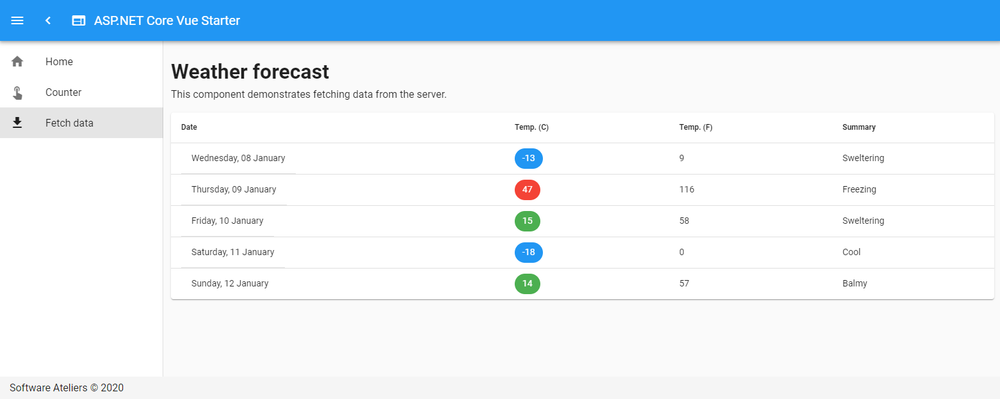

# ASP.NET Core Vue Starter

The repository contains an ASP.&#8203;NET Core + Vue.js starter template. The template runs on ASP.NET Core 5.0 and is created by Vue CLI 4.0 with a new plugin based architecture allowing developers to interactively scaffold a new project with just a one command.

Original article how to create the starter template is available [here](https://medium.com/software-ateliers/asp-net-core-vue-template-with-custom-configuration-using-cli-3-0-8288e18ae80b).

> For ASP.NET Core 3.1 template use [release v2.6.0](https://github.com/SoftwareAteliers/asp-net-core-vue-starter/releases/tag/2.6.0)

> For ASP.NET Core 2.2 template use [release v1.1.0](https://github.com/SoftwareAteliers/asp-net-core-vue-starter/releases/tag/1.1.0)
---

## Table of Contents

* [Features](#features)
* [Used Technology Stack](#used-technology-stack)
* [Prerequisites](#prerequisites)
* [Getting Started](#getting-started)

## Features

* Hot module replacement
* Code-splitting
* Tree-shaking
* ES2017 transpilation
* Long term caching and so on

## Used Technology Stack

**ASP.NET Core 5.0:**

* Web.API
* Vue CLI and JavaScript Services middlewares to integrate with client app

**Vue.js with CLI 4.0 supporting optional integrations:**

* TypeScript
* Progressive Web App
* Vue Router & Vuex (State Store)
* Linting, unit testing, E2E testing
* 3rd party component frameworks (Vuetify, Vue Bootstrap etc.)
* publish your personal/enterprise plugin and so on...

*For a full feature list, I suggest you to read the [official CLI release statement](https://medium.com/the-vue-point/vue-cli-3-0-is-here-c42bebe28fbb) by Evan You.*

## Prerequisites

* [.NET Core](https://www.microsoft.com/net/download/windows) >= 5.0
* [NodeJS](https://nodejs.org/) >= 8.9
* [Vue CLI](https://cli.vuejs.org/) >= 4.0
* Your favourite editor (I prefer [VS Code](https://code.visualstudio.com/)), or VS 2017/19

---

## Getting started

There are two ways how to set up the project: one for people who want to create their own template and choose custom integrations and the other for developers who want to start with no configuration.

## Clone the starter with default configuration

* Clone this repository `git clone https://github.com/SoftwareAteliers/asp-net-core-vue-starter`

or you can use .NET Core CLI templates:

* Install the template from NuGet repository: `dotnet new -i SoftwareAteliers.Alex.RealTimeStatistics`

* Initialize the project: `dotnet new vue -o MyProject`

## (Optional) Scaffold Vue.js app with custom configuration

If you prefer to overwrite default Vue client app with custom settings, take the following steps:

* **Remove all the contents** of the folder /ClientApp
* Create a new Vue project by using Vue CLI: `vue create client-app` OR by using CLI graphical interface running `vue ui`

> Unfortunately Vue CLI does not allow us to set a project name by C# standards using Upper Camel Case (Pascal Case) naming convention, so let's initiate app inside of client-app folder and then move the content to ClientApp.

* **Move all the contents from the new folder /client-app to /ClientApp.**

Now application is ready to run.

## Run the application

You have three choices when it comes to how you prefer to run the app. You can either use the command line or the build-in run command.

### 1. Using the command line

* Run the .NET application using `dotnet run`

### 2. Using the built-in run command

* Run the application in VSCode or Visual Studio 2017 by hitting `F5`

> It will take some time during the first run to download all client side dependencies.

Browse to [http://localhost:5000](http://localhost:5000) for ASP.&#8203;NET Core + Vue app or browse to [http://localhost:8080](http://localhost:8080) for Vue app only.

## Publish the application

### 1. Folder output

* Run the .NET publish command using Release configuration: `dotnet publish -c Release`

or

* Follow the Publish wizard in Visual Studio selecting Folder profile.

### 2. Docker output

* Run the following command in a cmd window to build the docker image:
`docker build -t <IMAGE_NAME> .`

> ATTENTION! Do not miss the final dot to build the current directory

* Run the application in a cmd window by this command:
`docker run -d -p 5000:80 <IMAGE_NAME>`

## View your application running

## Recommended plugin for debugging Vue

* Get Chrome DevTools for Vue.js [here](https://chrome.google.com/webstore/detail/vuejs-devtools/nhdogjmejiglipccpnnnanhbledajbpd)

---

## Issues and Contribution

Want to file a bug, contribute some code, or improve documentation? Excellent! Please make sure to check existing issues before opening a new one.

---

## Contributors

Special thanks to everyone who helped and contributed to this project!

* [@jdebarochez](https://github.com/jdebarochez)
* [@arisliang](https://github.com/arisliang)
* [@dotnetshadow](https://github.com/dotnetshadow)
* [@NickStees](https://github.com/NickStees)
* [@wallyjue](https://github.com/wallyjue)
* [@Ibrahim-Islam](https://github.com/Ibrahim-Islam)
* [@bickycheese](https://github.com/bickycheese)
* [@nickyg91](https://github.com/nickyg91)
* [@glebov21](https://github.com/glebov21)
* [@TobbenTM](https://github.com/TobbenTM)
* [@JohnCampionJr](https://github.com/JohnCampionJr)

---

## License

Copyright &copy; 2018 - 2021 [Software Ateliers](https://github.com/SoftwareAteliers)

## Where to find me

Medium: [Software Ateliers](https://medium.com/software-ateliers) | Twitter: [@SAteliers](https://twitter.com/SAteliers)